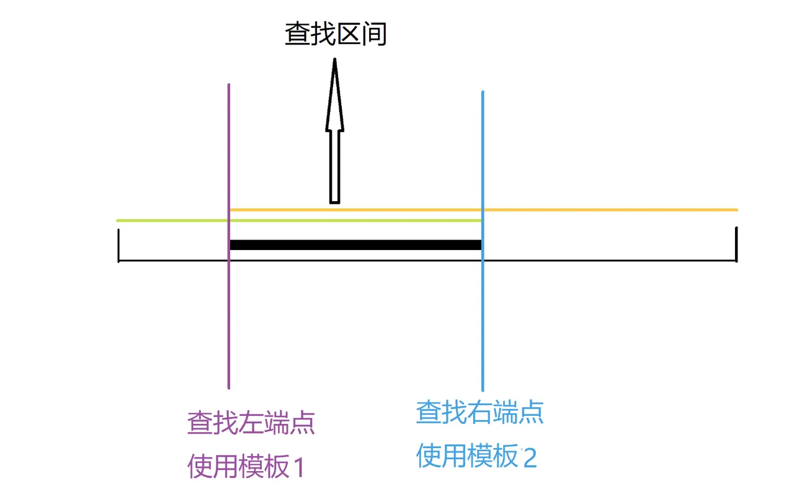

## 二分法

二分法的关键在于每次将区间分成两个部分，区间的开闭定义很重要，建议每次都定义闭区间

二分法有两个模板:



模板一：查找左端点，定义时就应该定义成 `if (check(mid) >= target)`

如何理解呢？   
将 `check(mid)`看成右拳头，`target`看成是左拳头，这是一个右拳头不断向左拳头靠近的过程，
当右拳头走到左拳头的左边时，停止循环，此时右拳头就是左边界。

```java
public int binarySearch(int[] nums, int target) {
    int left = 0;
    int right = nums.length - 1;
    while (left < right) {
        int mid = (left + right) >> 1;
        if (nums[mid] >= target) {
            right = mid;
        } else {
            left = mid + 1;
        }
    }
    return right;
}
```

模板二：查找右端点，定义时就应该定义成 `if (check(mid) <= target)`   

如何理解呢？

将`check(mid)`看成是左拳头，`target`看成是右拳头，这是一个左拳头不断向右拳头靠近的过程，当左拳头走到右拳头的右边时，
停止循环，此时左拳头就是右边界。   

```java
public int binarySearch(int[] nums, int target) {
    int left = 0;
    int right = nums.length - 1;

    while (left < right) {
        int mid = (left + right + 1) >> 1;
        if (nums[mid] <= target) {
            // 按照这个模板，如果出现 left = mid时，上述求mid的公式需要+1
            left = mid;
        } else {
            right = mid - 1;
        }
    }
    return left;
}
```

## 总结    
1. 在写mid时，可以先不加上1，当发现 left = mid时，则需要在计算mid时加上1
2. left < right，不能写 <=，否则可能会死循环
3. golang的 >> 优先级大于+，因此，需要加上括号


以从小到大排序为例：

1. 如果存在target，则取left或者right都可以
2. 如果不存在target，那么
	1. 最终left指向的是比target大的，且离得最近的元素
	2. 最终right指向的是比target小的，且离得最近的元素


## 模板题     


